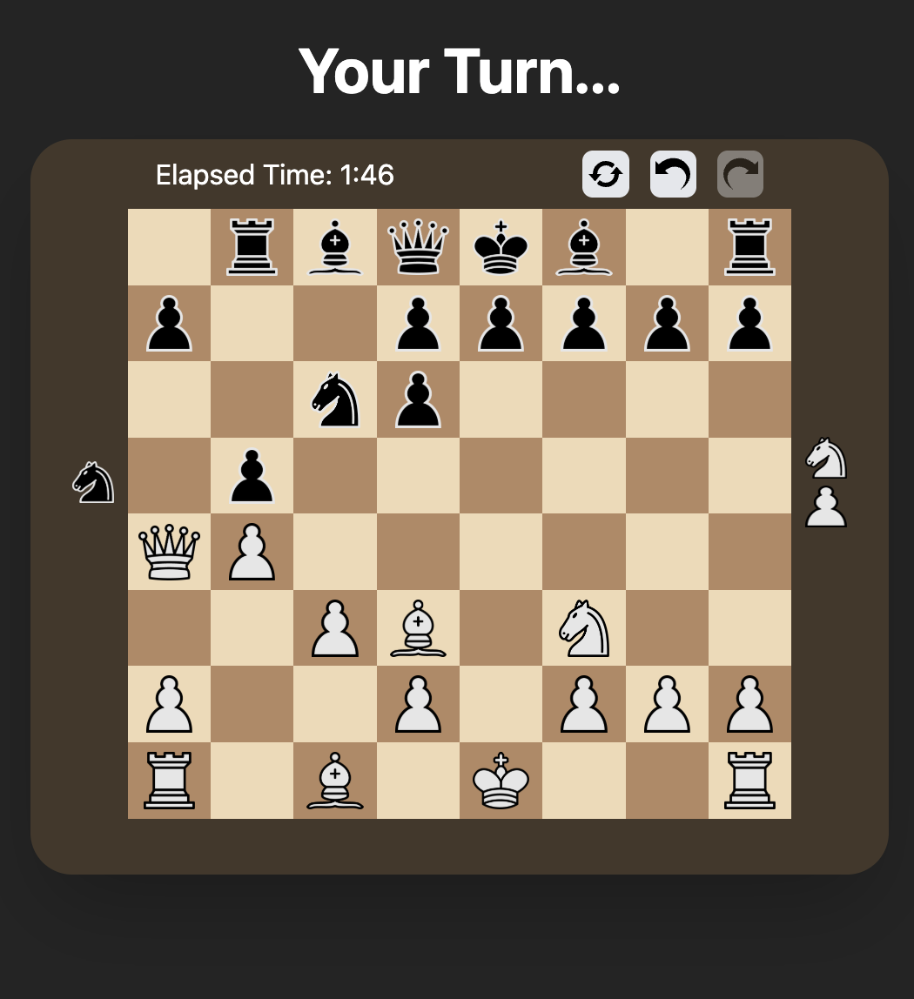
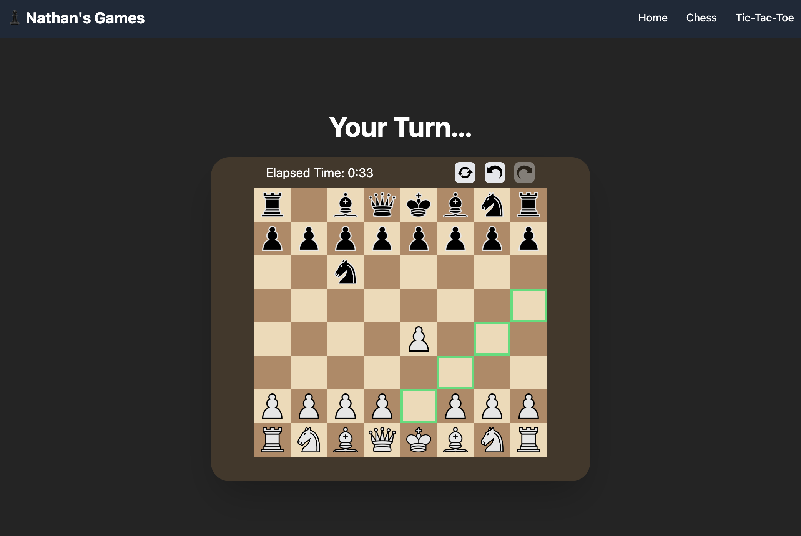

Based on my VisualChess (using WPF), a web-based frontend has been developed with Sveltekit, Typescript and Tailwind CSS. This interacts with an adapted version of the previous minimaxchess using an API.

Screenshots demonstrating the concept can be found below:

